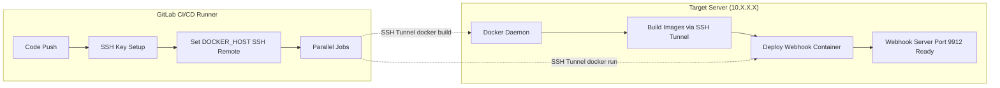
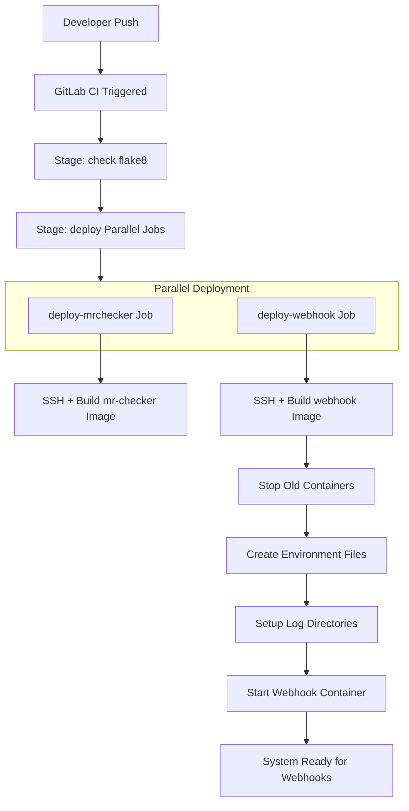
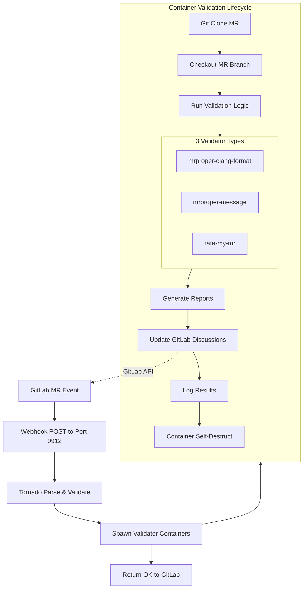
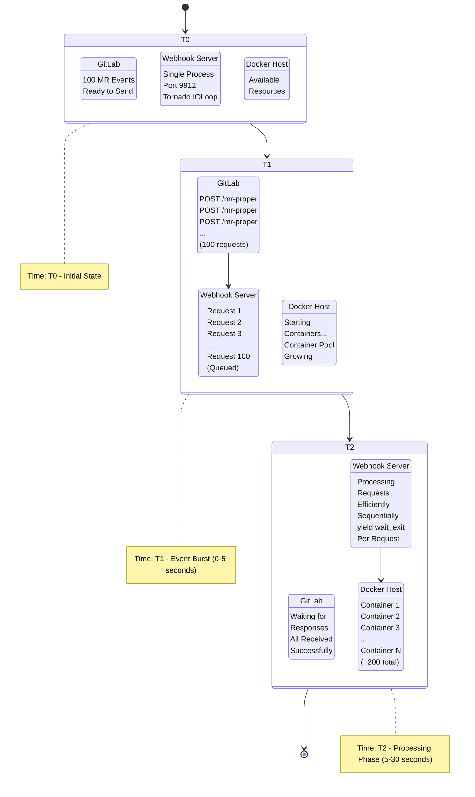
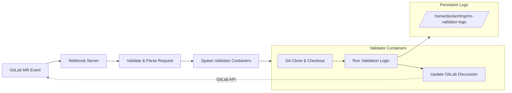
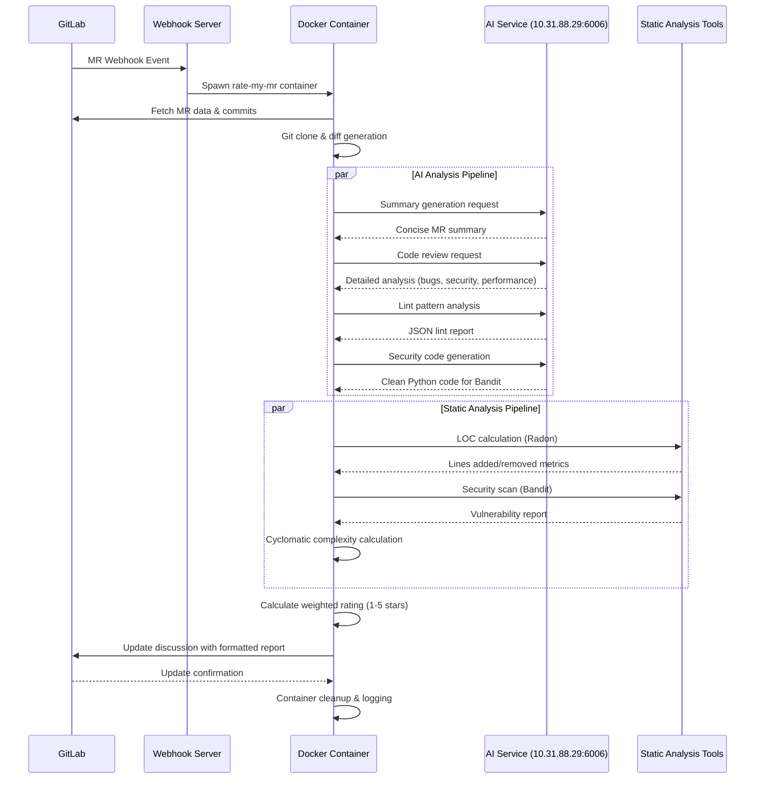
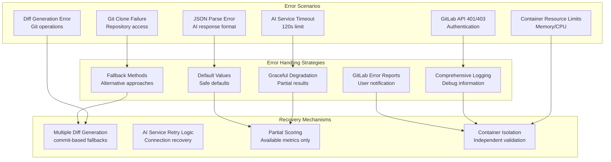

# MR Validator - Architecture Documentation

## Table of Contents

- [MR Validator - Architecture Documentation](#mr-validator---architecture-documentation)
  - [Table of Contents](#table-of-contents)
  - [System Overview](#system-overview)
  - [Deployment](#deployment)
    - [GitLab Deployment Diagram](#gitlab-deployment-diagram)
    - [GitLab Deployment Flow Diagram](#gitlab-deployment-flow-diagram)
  - [System Operations by Phase](#system-operations-by-phase)
    - [Phase 1: CI/CD Deployment](#phase-1-cicd-deployment)
    - [Phase 2: Webhook Processing & Validation](#phase-2-webhook-processing--validation)
    - [Phase 3: Rate my MR Deep Dive](#phase-3-rate-my-mr-deep-dive)
  - [High-Volume Processing Behavior](#high-volume-processing-behavior)
    - [Concurrent Load Scenario - 100 Merge Request Events](#concurrent-load-scenario---100-merge-request-events)
    - [Performance Characteristics](#performance-characteristics)
    - [Example Request Flow](#example-request-flow)
  - [Component Architecture](#component-architecture)
    - [Webhook Server (`webhook-server/`)](#webhook-server-webhook-server)
    - [MRProper Validation Library (`mrproper/`)](#mrproper-validation-library-mrproper)
    - [Validation Modules](#validation-modules)
      - [Code Formatting (`git_format.py`)](#code-formatting-git_formatpy)
      - [Commit Message Validator (`message.py`)](#commit-message-validator-messagepy)
      - [AI Quality Assessment (`rate_my_mr_gitlab.py`)](#ai-quality-assessment-rate_my_mr_gitlabpy)
  - [Technology Stack](#technology-stack)
    - [Infrastructure](#infrastructure)
    - [GitLab Integration](#gitlab-integration)
    - [AI/Analysis Services](#aianalysis-services)
  - [Security Model](#security-model)
  - [Performance Characteristics](#performance-characteristics-1)
    - [High-Volume Processing](#high-volume-processing)
    - [Scalability Metrics](#scalability-metrics)
    - [Logging Architecture](#logging-architecture)

## System Overview

The MR Validator is an automated GitLab merge request validation system consisting of two main components working in tandem to provide comprehensive code quality assessment.

1. **GitLab** sends webhook events when merge requests are created/updated
2. **Webhook Server** receives events and validates request parameters
3. **Docker Containers** execute validation logic in isolated environments
4. **MRProper Library** performs actual validation and updates GitLab discussions

## Deployment
### GitLab Deployment Diagram

**GitLab CI/CD Pipeline:**
- GitLab Runner (CI Environment)
  1. Code Checkout
  2. SSH Key Setup (LDOCKER_SSH_KEY)
  3. Set DOCKER_HOST → ssh://docker@10.X.X.X
  4. Execute Remote Docker Commands

  ↓ (SSH Tunnel)

**Target Server (10.X.X.X) - wtl-ldocker-2:**
- Docker Daemon
  - **BUILD PHASE:**
    - `docker build -t mr-checker-vp-test mrproper/`
    - `docker build -t mrproper-webhook-vp-test webhook-server/`

  - **DEPLOY PHASE:**
    - `docker stop/rm old containers`
    - `docker run mrproper-webhook-vp-test (port 9912)`
    - Volume mounts: `/home/docker/tmp/mr-validator-logs`

  - **RUNTIME PHASE:**
    - Webhook server spawns `mr-checker-vp-test` containers
    - Each validation runs in isolated container
    - Logs persist in `/home/docker/tmp/mr-validator-logs/`

### GitLab Deployment Flow Diagram



## System Operations by Phase

### Phase 1: CI/CD Deployment



### Phase 2: Webhook Processing & Validation



**Key Distinctions:**
1. **MR Validator Code**: Checked out by GitLab CI → Built into images
2. **Webhook Operations**: No git operations, only HTTP handling and container orchestration
3. **Target Project Code**: Cloned by validator containers → Analyzed for quality

**Three different operational contexts with distinct purposes!**

## High-Volume Processing Behavior

### Concurrent Load Scenario - 100 Merge Request Events

When 100 MR events arrive simultaneously:



### Performance Characteristics

- **Processing**: 100 requests × 2-3 validators = ~200 containers
- **Memory Usage**: ~200MB per container = ~40GB total
- **Timeline**: Complete processing within 5 minutes
- **Scalability**: System handles 200+ concurrent containers

### Example Request Flow




## Component Architecture

### Webhook Server (`webhook-server/`)
- **Technology**: Tornado web framework (Python 3 Alpine)
- **Port**: 9912 (configurable)
- **Function**: HTTP webhook handler that receives GitLab events

**Key Features:**
- Validates incoming webhooks and allowed checker types
- Filters events (ignores jenkins user, handles only MR events)
- Spawns isolated Docker containers for each validation type
- Supports concurrent multi-validator execution per MR

### MRProper Validation Library (`mrproper/`)
- **Technology**: Python with GitLab API integration
- **Base Image**: Ubuntu 20.04 with custom clang-format tooling
- **Function**: Core validation logic executed inside Docker containers

**Supported Validators:**
- `mrproper-clang-format` - Code formatting validation
- `mrproper-message` - Commit message standards validation
- `rate-my-mr` - AI-powered comprehensive MR quality assessment

### Validation Modules

#### Code Formatting (`git_format.py`)
- Clones MR branch to temporary directory
- Runs `git format --fixup` on each commit individually
- Detects formatting violations per commit
- Posts detailed formatting report to GitLab discussions
- Auto-resolves when all issues are fixed

#### Commit Message Validator (`message.py`)
- Validates commit message format: `TAG(TICKET): Subject`
- Enforces organizational standards (length, capitalization, etc.)
- Cross-references `Reviewed-By` trailers with GitLab approvals
- Supports project-specific configuration via `.mr-proper.conf`
- Prevents manual resolution until compliance achieved

#### AI Quality Assessment (`rate_my_mr_gitlab.py`)
- **AI Summary**: Generates concise MR overview using AI service
- **AI Code Review**: Comprehensive analysis for bugs, security, performance
- **LOC Analysis**: Tracks lines added/removed with limits enforcement
- **Lint Pattern Detection**: Identifies new pylint disable statements
- **Security Scanning**: Uses Bandit for security vulnerability detection
- **Cyclomatic Complexity**: Measures code complexity metrics
- **Quality Rating**: 1-5 star scoring system with blocking capabilities

## Technology Stack

### Infrastructure
- **Docker**: Container isolation and dependency management
- **Tornado**: Async web framework for webhook handling
- **Git**: Repository cloning and commit analysis
- **Ubuntu/Alpine**: Base container images

### GitLab Integration
- **API v4**: Comprehensive GitLab API integration
- **OAuth Authentication**: Secure API access via private tokens
- **Webhook Events**: Real-time MR event processing
- **Discussion API**: Automated comment management

### AI/Analysis Services
- **External AI Service**: Code analysis and review generation (`http://10.31.88.29:6006`)
- **Bandit**: Python security vulnerability scanning
- **Radon**: Cyclomatic complexity analysis
- **Custom LOC Calculator**: Lines of code analysis

## Security Model

- **Container Isolation**: All validations run in isolated Docker environments
- **Non-privileged Execution**: Validators run as `mrcheck` user
- **API Authentication**: GitLab private tokens for secure API access
- **Allowed Checker Validation**: Only predefined validator types accepted
- **User Filtering**: Automated exclusion of system users (jenkins)

## Performance Characteristics

### High-Volume Processing
- **Concurrent Container Handling**: Supports 200+ simultaneous validations
- **Sequential Webhook Processing**: Tornado handles requests reliably one-by-one
- **Resource Management**: ~40GB memory capacity for 100 MRs with dual validators
- **API Load Distribution**: 800-1200 GitLab API calls distributed over validation window

### Scalability Metrics
- **Webhook Response**: <5 seconds acknowledgment to GitLab
- **Validation Completion**: 3-5 minutes for comprehensive analysis
- **Container Lifecycle**: Auto-cleanup via `--rm` flag
- **Memory Usage**: ~200MB per validation container

### Logging Architecture

**Enhanced with Request Correlation (2025-11-03)**:
```
Host: /home/docker/tmp/mr-validator-logs/
├── webhook-server.log                              # Webhook activities, 100MB×5 backups
├── rate-my-mr-{REQUEST_ID}-{container}.log        # Per-request logs, 50MB×3 backups
├── gitlab-api-{REQUEST_ID}-{container}.log        # API interactions, 50MB×3 backups
└── ...
```

**Key Features**:
- **Request Correlation**: REQUEST_ID propagates from webhook to all validator logs
- **Log Rotation**: Automatic rotation prevents disk exhaustion
- **Structured Format**: All logs include `[REQUEST_ID_SHORT]` prefix for easy tracing
- **Thread-Safe**: Unique filenames prevent race conditions in concurrent validations

**Tracing Requests**:
```bash
# Find all activity for a specific request
grep "a1b2c3d4" /home/docker/tmp/mr-validator-logs/*.log

# View specific request log
cat /home/docker/tmp/mr-validator-logs/rate-my-mr-a1b2c3d4-*.log
```

### Recent Reliability Improvements (2025-11-03)

#### Error Handling Enhancements
- **No Silent Failures**: All exceptions logged with stack traces
- **Proper Status Reporting**: AI service failures accurately reflected in validation reports
- **Git Command Validation**: Return codes checked and errors properly reported

#### Retry Logic & Resilience
- **AI Service Retry**: Exponential backoff (2s, 4s, 8s) for up to 3 retries
- **Smart Retry Strategy**: Retries on timeouts, connection errors, 5xx, and 429; no retry on 4xx client errors
- **Graceful Degradation**: Continues with partial results if non-critical services fail

#### Resource Management
- **Temporary File Cleanup**: Thread-safe handling with proper cleanup in finally blocks
- **No File Leaks**: All temporary files removed even on error paths
- **Memory Efficient**: Optimized diff processing and resource allocation


## Phase 3: Rate my MR Deep Dive

### AI-Powered Quality Assessment Architecture

The "Rate my MR" validator represents the most sophisticated component of the MR Validator system, combining artificial intelligence with static analysis to provide comprehensive code quality assessment.

#### **System Design Principles**
1. **AI-First Approach**: Leverages large language models for intelligent code analysis
2. **Containerized Isolation**: Each analysis runs in isolated Docker environment
3. **Configurable Scoring**: Weight-based quality metrics with organizational customization
4. **Graceful Degradation**: Continues operation even with partial service failures
5. **GitLab Native**: Deep integration with GitLab workflow and UI

#### **Component Interaction Flow**


### **7-Step Analysis Pipeline**

#### **Step 1: AI-Powered Summary Generation**
```json
{
  "messages": [
    {
      "role": "system",
      "content": "You are a summarizer. Provide a concise summary of the git diff output."
    },
    {
      "role": "user",
      "content": "{diff_content}"
    }
  ]
}
```

#### **Step 2: Comprehensive AI Code Review**
```json
{
  "messages": [
    {
      "role": "system",
      "content": "You are a code reviewer tasked with evaluating code. Focus on: Bugs, Code Quality, Security Concerns, Performance. Provide specific examples from the code to support your comments and suggestions."
    },
    {
      "role": "user",
      "content": "{diff_content}"
    }
  ]
}
```

#### **Step 3: Lines of Code (LOC) Analysis**
- **Technology**: Radon static analysis library
- **Metrics**: Lines added, removed, net change
- **Threshold**: 500 lines maximum (configurable)
- **Weight**: 1 point deduction if exceeded
- **Implementation**: `mrproper/mrproper/loc.py`

#### **Step 4: Lint Disable Pattern Analysis**
```json
{
  "messages": [
    {
      "role": "system",
      "content": "Analyze git diff for # pylint: disable= comments. Count total instances and report in JSON: {\"num_lint_disable\": <number>, \"lints_that_disabled\": \"rule1,rule2\"}. Lines starting with + are added, - are removed. Nullify if same is removed and added elsewhere."
    },
    {
      "role": "user",
      "content": "{diff_content}"
    }
  ]
}
```

#### **Step 5: Security Vulnerability Scanning**
- **AI Code Generation**: Extracts added code into valid Python for analysis
- **Scanner**: Bandit security vulnerability detection
- **Threshold**: 0.005 issues per LOC (1 issue per 200 lines)
- **Weight**: 1 point deduction if exceeded
- **Implementation**: `mrproper/mrproper/security_scan.py`

**AI Prompt for Code Generation**:
```json
{
  "messages": [
    {
      "role": "system",
      "content": "Extract newly added code from git diff and generate valid Python file for Bandit scanning. Rules: 1) Lines starting with '+' are additions 2) New functions included as-is 3) Loose statements wrapped in __bandit_dummy__() 4) Handle 'self' references with dummy class 5) Add placeholder definitions for undefined variables 6) Preserve comments including pylint directives 7) Ensure AST-parseable output"
    },
    {
      "role": "user",
      "content": "{diff_content}"
    }
  ]
}
```

#### **Step 6: Cyclomatic Complexity Analysis**
- **Algorithm**: Decision point counting (if, for, while, elif, &&, ||, case, except)
- **Scope**: Modified/new functions only
- **Threshold**: Average complexity ≤ 10
- **Weight**: 2 point deduction if exceeded (highest penalty)
- **Implementation**: `mrproper/mrproper/cyclomatic_complexity.py`

#### **Step 7: Quality Rating Calculation**
```python
# Rating Weights (configurable in params.py)
class RMMWeights(Enum):
    TOTAL_WEIGHT = 5                # Perfect score baseline
    MAX_LOC = 1                     # Lines of code penalty
    LINT_DISABLE = 1                # Lint suppressions penalty
    CYCLOMATIC_COMPLEXITY = 2       # Code complexity penalty (highest)
    SECURITY_SCAN = 1               # Security issues penalty

class RMMLimits(Enum):
    MAX_LOC = 500                   # Maximum lines of code
    CYCLOMATIC_COMPLEXITY = 10      # Maximum average complexity
    SECURITY_SCAN = 0.005          # Maximum issues per LOC

# Calculation Logic
def calculate_rating(analysis_results):
    effective_rating = 5

    if analysis_results.net_loc > RMMLimits.MAX_LOC.value:
        effective_rating -= RMMWeights.MAX_LOC.value

    if analysis_results.lint_disables > 0:
        effective_rating -= RMMWeights.LINT_DISABLE.value

    if analysis_results.avg_complexity > RMMLimits.CYCLOMATIC_COMPLEXITY.value:
        effective_rating -= RMMWeights.CYCLOMATIC_COMPLEXITY.value

    if (analysis_results.high_security_issues or
        analysis_results.security_ratio > RMMLimits.SECURITY_SCAN.value):
        effective_rating -= RMMWeights.SECURITY_SCAN.value

    return max(effective_rating, 0)  # Never go below 0
```

### **Data Processing Architecture**

```mermaid
flowchart LR
    subgraph input ["Input Processing"]
        A1[Git Diff File]
        A2[MR Metadata]
        A3[Commit History]
    end

    subgraph ai ["AI Analysis Layer"]
        B1[Summary Generation]
        B2[Code Review Analysis]
        B3[Lint Pattern Detection]
        B4[Security Code Generation]
    end

    subgraph static ["Static Analysis Layer"]
        C1[Radon LOC Metrics]
        C2[Bandit Security Scan]
        C3[Complexity Calculator]
    end

    subgraph scoring ["Scoring Engine"]
        D1[Weight Calculator]
        D2[Threshold Evaluator]
        D3[Rating Generator]
    end

    subgraph output ["Output Generation"]
        E1[GitLab Report Formatter]
        E2[Auto-Resolution Decision]
        E3[Structured Logging]
    end

    input --> ai
    input --> static
    ai --> scoring
    static --> scoring
    scoring --> output

    style ai fill:#e1f5fe
    style static fill:#fff3e0
    style scoring fill:#e8f5e8
```


### **AI Prompt Engineering Strategy**

#### **Design Principles**
1. **Structured Prompts**: Each AI call uses specific role-based messaging
2. **Context Preservation**: Git diff content maintains full context for analysis
3. **Output Formatting**: JSON responses for machine-parseable results
4. **Error Recovery**: Fallback mechanisms for AI service unavailability

#### **Prompt Optimization Techniques**
- **Role Definition**: Clear system prompts define AI behavior and expectations
- **Output Constraints**: Specific format requirements (JSON, markdown, etc.)
- **Context Injection**: Full diff content preserves change context
- **Validation Rules**: Built-in logic validation for AI responses

### **Error Handling & Resilience Architecture**



### **Performance Optimization & Scalability**

#### **Parallel Processing Design**
- **AI Analysis**: 4 concurrent AI service calls per MR
- **Static Analysis**: Parallel execution with AI pipeline
- **Container Isolation**: Independent resource allocation per validation
- **Resource Management**: Memory-efficient diff processing

#### **Performance Characteristics**
- **Analysis Time**: 3-5 minutes per MR (dependent on AI service latency)
- **Concurrent Capacity**: 100+ simultaneous MR validations
- **Memory Usage**: ~200MB per validation container
- **AI Service Load**: 4 API calls per MR (summary, review, lint, security)
- **Network Efficiency**: Single diff generation, multiple analysis passes

#### **Optimization Strategies**
```python
# Container lifecycle optimization
def optimize_container_performance():
    # 1. Pre-built Docker layers for fast startup
    # 2. Git operations cached per container lifecycle
    # 3. Dependency pre-installation in base image
    # 4. Memory-efficient diff processing
    # 5. Cleanup and resource management

    # AI service optimization
    # 1. Connection pooling and reuse
    # 2. Request batching where possible
    # 3. Timeout management and retry logic
    # 4. Response caching for identical diffs
```

### **Configuration & Customization**

#### **Organizational Customization Examples**

**Strict Quality Standards (Critical Projects)**:
```python
class RMMLimits(Enum):
    MAX_LOC = 200                    # Smaller change sets
    CYCLOMATIC_COMPLEXITY = 5        # Lower complexity tolerance
    SECURITY_SCAN = 0.001           # 1 issue per 1000 LOC

class RMMWeights(Enum):
    CYCLOMATIC_COMPLEXITY = 3       # Higher complexity penalty
    SECURITY_SCAN = 2               # Higher security penalty
```

**Lenient Standards (Legacy Refactoring)**:
```python
class RMMLimits(Enum):
    MAX_LOC = 1000                   # Allow larger refactoring
    CYCLOMATIC_COMPLEXITY = 15       # Higher complexity tolerance
    SECURITY_SCAN = 0.01            # More lenient security threshold

class RMMWeights(Enum):
    LINT_DISABLE = 0                # Don't penalize lint disables
    MAX_LOC = 0                     # Don't penalize large changes
```

### **Troubleshooting Guide**

#### **AI Service Issues**
```bash
# Check AI service connectivity
curl -X POST http://10.31.88.29:6006/generate \
  -H "Content-Type: application/json" \
  -d '{"messages":[{"role":"user","content":"test"}]}'

# Monitor AI service calls in logs
grep "AI Service Request" /home/docker/tmp/mr-validator-logs/rate-my-mr-*.log

# Verify all 4 AI calls completed successfully
grep "status_code.*200" /home/docker/tmp/mr-validator-logs/rate-my-mr-*.log
```

#### **Security Scan Issues**
```bash
# Check AI code generation step
grep "generate_added_code_file" /home/docker/tmp/mr-validator-logs/rate-my-mr-*.log

# Verify Bandit execution
grep "bandit.*json" /home/docker/tmp/mr-validator-logs/rate-my-mr-*.log

# Check for AST parsing errors
grep "AST.*parse" /home/docker/tmp/mr-validator-logs/rate-my-mr-*.log
```

#### **Rating Calculation Issues**
```bash
# Debug rating calculation process
grep "effective_rating" /home/docker/tmp/mr-validator-logs/rate-my-mr-*.log

# Check threshold violations
grep -E "(LOC|complexity|security).*exceeded" /home/docker/tmp/mr-validator-logs/rate-my-mr-*.log

# Verify weight calculations
grep "Rating.*calculated" /home/docker/tmp/mr-validator-logs/rate-my-mr-*.log
```

### **Integration Points**

#### **GitLab Discussion Format**
The system generates structured GitLab discussions with:
- **Star Rating Visualization**: ⭐⭐⭐⭐⚪ (4/5)
- **Metric Breakdown Table**: Detailed scoring per dimension
- **Auto-Resolution Logic**: Score < 3 prevents manual resolution
- **Rich Formatting**: Emojis, tables, and structured sections

#### **Logging Architecture**
```
/home/docker/tmp/mr-validator-logs/
├── rate-my-mr-{container-id}.log        # Main analysis logging
├── gitlab-api-{container-id}.log        # GitLab API interactions
└── webhook-server.log                   # Container orchestration
```

#### **Container Environment**
- **Base Image**: Ubuntu with Python 3, Git, and analysis tools
- **Environment Variables**: GitLab token, AI service configuration
- **Volume Mounts**: Log persistence, Docker socket access
- **Resource Limits**: Memory and CPU constraints for stability

---

*This Phase 3 documentation provides comprehensive technical details for understanding, maintaining, and extending the Rate my MR AI-powered quality assessment system.*