# MR Validator - Architecture & Technical Guide

Technical documentation for developers and system architects.

## Table of Contents

- [System Overview](#system-overview)
  - [Request Flow](#request-flow)
- [Component Architecture](#component-architecture)
  - [Directory Structure](#directory-structure)
  - [Component Responsibilities](#component-responsibilities)
  - [Routing Logic](#routing-logic)
- [LLM Integration](#llm-integration)
  - [JWT Token Flow](#jwt-token-flow)
  - [Request Transformation](#request-transformation)
  - [Response Transformation](#response-transformation)
- [Configuration System](#configuration-system)
  - [Loading Priority](#loading-priority)
  - [config_loader.py](#config_loaderpy)
  - [Feature Flag Usage](#feature-flag-usage)
- [Logging System](#logging-system)
  - [Structured Format](#structured-format)
  - [Module Name Mapping](#module-name-mapping)
  - [Child Logger Configuration](#child-logger-configuration)
  - [Directory Structure](#directory-structure-1)
- [Analysis Pipeline](#analysis-pipeline)
  - [Pipeline Steps](#pipeline-steps)
  - [Rating Algorithm](#rating-algorithm)
- [GitLab API Integration](#gitlab-api-integration)
  - [Key Functions](#key-functions)
  - [Comment Update Logic](#comment-update-logic)
- [Security Model](#security-model)
  - [Authentication Methods](#authentication-methods)
  - [Token Security](#token-security)
  - [Container Isolation](#container-isolation)
- [Performance Metrics](#performance-metrics)
  - [Optimization Strategies](#optimization-strategies)
- [Error Handling](#error-handling)
  - [Retry Logic](#retry-logic)
  - [Graceful Degradation](#graceful-degradation)
- [Adding New Features](#adding-new-features)
  - [1. Add New Analysis Module](#1-add-new-analysis-module)
  - [2. Register Logger](#2-register-logger)
  - [3. Add Module Name Mapping](#3-add-module-name-mapping)
  - [4. Add Feature Flag](#4-add-feature-flag)
  - [5. Integrate in Pipeline](#5-integrate-in-pipeline)
- [Related Documentation](#related-documentation)

---

## System Overview


### Request Flow

```mermaid
sequenceDiagram
    autonumber
    participant GL as ◆ GitLab
    participant WH as ◉ Webhook Server
    participant DC as ▣ Docker
    participant VA as ★ Validator
    participant BFA as ◎ BFA Service

    rect rgb(255, 212, 196, 0.3)
        Note over GL,WH: Webhook Trigger
        GL->>WH: POST /mr-proper/rate-my-mr
        Note over WH: Generate REQUEST_ID<br/>20251117_101804_715563
    end

    rect rgb(197, 232, 247, 0.3)
        Note over WH,VA: Container Lifecycle
        WH->>DC: docker run --env REQUEST_ID=...
        DC->>VA: Start container (mr-rate-my-mr-42-71556)
    end

    rect rgb(255, 243, 196, 0.3)
        Note over VA,BFA: Authentication & Analysis
        VA->>GL: GET /api/v4/projects/.../merge_requests/42
        GL-->>VA: MR metadata (title, author, branch)
        VA->>BFA: POST /api/token<br/>{"subject": "rate-my-mr-org%2Frepo-42"}
        BFA-->>VA: {"token": "eyJhbGci..."}
        Note over VA: Cache token for reuse

        loop 4 AI Calls (Summary, Review, Lint, LOC)
            VA->>BFA: POST /api/rate-my-mr<br/>Authorization: Bearer {token}
            BFA-->>VA: AI analysis response
        end
    end

    rect rgb(200, 230, 201, 0.3)
        Note over VA,GL: Report & Cleanup
        VA->>GL: POST /api/v4/.../discussions<br/>Rating: 4/5 ★
        GL-->>VA: 201 Created
        VA-->>DC: Exit 0 (success)
        DC-->>WH: Container completed
    end
```



---

## Component Architecture

### Directory Structure

```
commit-validator/
├── webhook-server/
│   ├── server.py              # Tornado HTTP handler
│   └── Dockerfile             # Alpine Python 3.9
├── mrproper/
│   ├── bin/
│   │   ├── rate-my-mr         # Entry point
│   │   ├── mrproper-clang-format
│   │   └── mrproper-message
│   ├── mrproper/
│   │   ├── gitlab.py          # GitLab API client
│   │   └── rate_my_mr/
│   │       ├── rate_my_mr_gitlab.py    # Main orchestrator
│   │       ├── rate_my_mr.py           # AI integration
│   │       ├── llm_adapter.py          # JWT auth adapter
│   │       ├── config_loader.py        # Repo config
│   │       ├── logging_config.py       # Structured logging
│   │       ├── loc.py                  # LOC metrics
│   │       ├── cyclomatic_complexity.py
│   │       ├── security_scan.py
│   │       └── cal_rating.py
│   └── Dockerfile             # Ubuntu 22.04
└── mrproper.env               # Runtime config
```

### Component Responsibilities

| Component | File | Purpose |
|-----------|------|---------|
| **Webhook Server** | `server.py` | HTTP endpoint, container spawning |
| **GitLab Client** | `gitlab.py` | API calls, discussion updates |
| **Orchestrator** | `rate_my_mr_gitlab.py` | Pipeline coordination |
| **LLM Adapter** | `llm_adapter.py` | JWT auth, request transformation |
| **Config Loader** | `config_loader.py` | Repository-level settings |
| **Logging** | `logging_config.py` | Structured pipe-separated logs |

---

## LLM Integration

### Routing Logic

```mermaid
flowchart TD
    A[📤 send_request] --> B{🔍 BFA_HOST<br/>configured?}
    B -->|"✅ Yes"| C[🤖 LLM Adapter Mode]
    B -->|"❌ No"| D[📡 Legacy Direct Mode]

    C --> E[🔑 Get JWT Token<br/>POST /api/token]
    E --> F[🔄 Transform Request<br/>Add metadata fields]
    F --> G[📨 POST /api/rate-my-mr<br/>Authorization: Bearer]
    G --> H[✨ Transform Response<br/>Extract summary_text]

    D --> I[📨 POST /generate<br/>Direct AI call]
    I --> J[📥 Raw Response<br/>No transformation]

    H --> K[🎯 Return to caller]
    J --> K

    classDef decision fill:#fff8dc,stroke:#e8d890,color:#333
    classDef newmode fill:#c8e6c9,stroke:#a5d6a7,color:#333
    classDef legacy fill:#ffe0b2,stroke:#ffcc80,color:#333
    classDef result fill:#bbdefb,stroke:#90caf9,color:#333

    class B decision
    class C,E,F,G,H newmode
    class D,I,J legacy
    class K result
```



### JWT Token Flow

```python
# Token acquired once per MR, reused for all 4 AI calls

# 1. Token request
POST http://{BFA_HOST}:8000/api/token
Body: {"subject": "rate-my-mr-org%2Frepo-42"}
Response: {"token": "eyJhbGci..."}

# 2. LLM calls with token
POST http://{BFA_HOST}:8000/api/rate-my-mr
Headers: Authorization: Bearer {token}
```

### Request Transformation

**Old format** (from rate_my_mr.py):
```python
{
    "messages": [
        {"role": "system", "content": "You are..."},
        {"role": "user", "content": "diff..."}
    ]
}
```

**New BFA format** (transformed by llm_adapter.py):
```python
{
    "repo": "org/repo",
    "branch": "feature/x",
    "author": "user@example.com",
    "commit": "abc123",
    "mr_url": "https://gitlab.com/.../42",
    "prompt": "{\"messages\": [...]}"  # JSON string
}
```

### Response Transformation

**BFA response:**
```python
{
    "status": "ok",
    "metrics": {"summary_text": "AI analysis..."},
    "sent_to": "..."
}
```

**Transformed** (backward compatible):
```python
{
    "content": [{"type": "text", "text": "AI analysis..."}]
}
```

---

## Configuration System

### Loading Priority

```mermaid
flowchart LR
    A[📋 Default Config<br/>All features enabled] --> B[📁 Repo Config<br/>.rate-my-mr.yaml]
    B --> C[🔀 Deep Merge<br/>Override defaults]
    C --> D[✅ Final Config<br/>Applied to pipeline]

    classDef default fill:#f5f5f5,stroke:#e0e0e0,color:#333
    classDef repo fill:#fff8dc,stroke:#e8d890,color:#333
    classDef merge fill:#e1f5fe,stroke:#b3e5fc,color:#333
    classDef final fill:#e8f5e9,stroke:#c8e6c9,color:#333

    class A default
    class B repo
    class C merge
    class D final
```



### config_loader.py

```python
DEFAULT_CONFIG = {
    'features': {
        'ai_summary': True,
        'ai_code_review': True,
        'loc_analysis': True,
        'lint_disable_check': True,
        'cyclomatic_complexity': True,
        'security_scan': True,
    },
    'loc': {'max_lines': 500},
    'cyclomatic_complexity': {'max_average': 10},
    'security': {'fail_on_high': True},
    'rating': {'pass_score': 3},
}

def load_config(repo_dir):
    """Load .rate-my-mr.yaml from repo root, merge with defaults."""
    config_path = os.path.join(repo_dir, '.rate-my-mr.yaml')
    if os.path.exists(config_path):
        with open(config_path, 'r') as f:
            repo_config = yaml.safe_load(f)
        return deep_merge(DEFAULT_CONFIG, repo_config)
    return DEFAULT_CONFIG.copy()

def is_feature_enabled(config, feature_name):
    """Check if feature is enabled in config."""
    return config.get('features', {}).get(feature_name, True)
```

### Feature Flag Usage

```python
# In rate_my_mr_gitlab.py
config = load_config(repo_dir)

if is_feature_enabled(config, 'ai_summary'):
    summary_success, summary_content = generate_summary(diff_file_path)
else:
    slog.info("AI summary skipped (disabled in config)")
    summary_success = False
```

---

## Logging System

### Structured Format

```
TIMESTAMP | LEVEL | MODULE | REQ_ID | MESSAGE | key=value
```

**Example:**
```
2025-11-17 10:15:23.456 | INFO  | main           | 12345678 | Starting MR analysis | project=org/repo mr_iid=42
2025-11-17 10:15:24.123 | INFO  | llm-adapter    | 12345678 | JWT token acquired | duration_ms=234
2025-11-17 10:15:26.789 | INFO  | rate-my-mr     | 12345678 | AI summary completed | success=True
```

### Module Name Mapping

```python
# In logging_config.py
MODULE_NAME_MAP = {
    'mrproper.rate_my_mr.rate_my_mr': 'rate-my-mr',
    'mrproper.rate_my_mr.llm_adapter': 'llm-adapter',
    'mrproper.rate_my_mr.loc': 'loc-analyzer',
    'mrproper.rate_my_mr.cyclomatic_complexity': 'cc-analyzer',
    'mrproper.rate_my_mr.security_scan': 'security-scan',
    'mrproper.rate_my_mr.cal_rating': 'rating-calc',
    'mrproper.rate_my_mr.config_loader': 'config-loader',
}

# Dynamic mapping
if module_name.startswith('validator.'):
    module_name = 'main'
elif module_name.startswith('webhook.'):
    module_name = 'webhook'
```

### Child Logger Configuration

```python
# In rate_my_mr_gitlab.py - ensures all modules log to same file
def configure_child_loggers():
    module_loggers = [
        'mrproper.rate_my_mr.rate_my_mr',
        'mrproper.rate_my_mr.llm_adapter',
        'mrproper.rate_my_mr.config_loader',
        # ...
    ]
    for module_name in module_loggers:
        module_logger = logging.getLogger(module_name)
        module_logger.handlers = []
        module_logger.addHandler(file_handler)
```

### Directory Structure

**Organized** (LOG_STRUCTURE=organized):
```
/home/docker/tmp/mr-validator-logs/
├── webhook/
│   └── 2025-11-17/
│       └── webhook-server.log
└── validations/
    └── 2025-11-17/
        └── org_repo/
            └── mr-42/
                └── rate-my-mr-12345678.log
```

---

## Analysis Pipeline

```mermaid
stateDiagram-v2
    [*] --> LoadConfig: Start Validation

    state "📁 Configuration" as Config {
        LoadConfig: 📋 Load .rate-my-mr.yaml
        LoadConfig --> CreateDiff
        CreateDiff: 📊 Generate Git Diff
    }

    state "🤖 AI Analysis (Conditional)" as AI {
        CreateDiff --> AISummary
        AISummary: 📝 Generate Summary
        AISummary --> AICodeReview
        AICodeReview: 🔍 Code Review
    }

    state "📈 Metrics Analysis (Conditional)" as Metrics {
        AICodeReview --> LOCAnalysis
        LOCAnalysis: 📏 Lines of Code
        LOCAnalysis --> LintCheck
        LintCheck: ⚠️ Lint Disables
        LintCheck --> SecurityScan
        SecurityScan: 🛡️ Bandit Scan
        SecurityScan --> Complexity
        Complexity: 🔄 Cyclomatic CC
    }

    state "🎯 Reporting" as Report {
        Complexity --> Rating
        Rating: ⭐ Calculate Score
        Rating --> PostToGitLab
        PostToGitLab: 💬 Post Discussion
    }

    PostToGitLab --> [*]: Exit 0

    note right of AI
        Skip if disabled in config
        features.ai_summary: false
    end note

    note right of Metrics
        Each step respects config flags
        features.security_scan: true
    end note
```



### Pipeline Steps

| Step | Module | Duration | Conditional |
|------|--------|----------|-------------|
| 1. Load Config | config_loader | ~10ms | Always |
| 2. Create Diff | git subprocess | ~1-3s | Always |
| 3. AI Summary | llm_adapter | ~2-4s | `features.ai_summary` |
| 4. AI Code Review | llm_adapter | ~3-5s | `features.ai_code_review` |
| 5. LOC Analysis | loc.py | ~50ms | `features.loc_analysis` |
| 6. Lint Check | rate_my_mr.py | ~50ms | `features.lint_disable_check` |
| 7. Security Scan | security_scan.py | ~500ms | `features.security_scan` |
| 8. Complexity | cyclomatic_complexity.py | ~200ms | `features.cyclomatic_complexity` |
| 9. Calculate Rating | cal_rating.py | ~10ms | Always |
| 10. Post to GitLab | gitlab.py | ~200ms | Always |

**Total: 8-15 seconds** for typical MR

### Rating Algorithm

```python
def cal_rating(net_loc, num_lint_disable):
    score = 5.0

    # LOC penalty
    if net_loc > 500:
        score -= 2.0
    elif net_loc > 200:
        score -= 1.0

    # Lint disable penalty
    if num_lint_disable > 5:
        score -= 1.0
    elif num_lint_disable > 0:
        score -= 0.5

    return max(1.0, min(5.0, score))
```

---

## GitLab API Integration

### Key Functions

```python
# gitlab.py

def gitlab(endpoint, params=None):
    """Generic GitLab API client."""
    headers = {"PRIVATE-TOKEN": GITLAB_ACCESS_TOKEN}
    response = requests.get(f"{GITLAB_HOST}/api/v4{endpoint}", headers=headers)
    return AttrDict(response.json())

def update_discussion(proj, mriid, header, body, must_not_be_resolved):
    """Create or update MR discussion."""
    # 1. Fetch existing discussions
    # 2. Search for note with matching header
    # 3. Update if found, create if not
    # 4. Set resolved status based on score
```

### Comment Update Logic

```mermaid
flowchart TD
    A[📋 Fetch All MR Discussions<br/>GET /discussions] --> B{🔍 Found existing<br/>Rate My MR comment?}

    B -->|"✅ Yes - Update"| C[📝 Compare Content]
    B -->|"❌ No - Create"| D[📨 POST /discussions<br/>Create new thread]

    C --> E{📊 Content<br/>changed?}
    E -->|"✅ Different"| F[✏️ PUT /notes/:id<br/>Update existing comment]
    E -->|"❌ Same"| G[⏭️ Skip update<br/>Save API call]

    D --> H[✅ New discussion created]
    F --> I[✅ Comment updated]
    G --> J[✅ No action needed]

    H --> K{⭐ Score >= 3?}
    I --> K
    K -->|"✅ Pass"| L[🟢 Set resolved = true]
    K -->|"❌ Fail"| M[🔴 Set resolved = false]

    classDef fetch fill:#e3f2fd,stroke:#b3d4f7,color:#333
    classDef decision fill:#fff8dc,stroke:#e8d890,color:#333
    classDef action fill:#f3e5f5,stroke:#e1bee7,color:#333
    classDef success fill:#e8f5e9,stroke:#c8e6c9,color:#333
    classDef pass fill:#c8e6c9,stroke:#a5d6a7,color:#333
    classDef fail fill:#ffcdd2,stroke:#ef9a9a,color:#333

    class A fetch
    class B,E,K decision
    class C,D,F,G action
    class H,I,J success
    class L pass
    class M fail
```



---

## Security Model

### Authentication Methods

| Service | Method | Token Storage |
|---------|--------|---------------|
| GitLab API | PRIVATE-TOKEN header | mrproper.env (file permission 0600) |
| BFA Service | JWT Bearer token | Memory only (not logged) |

### Token Security

- JWT scoped to `rate-my-mr-{project}-{mriid}`
- Token cleared on 401 errors
- Never fully logged (first 20 chars only)
- Expires server-side

### Container Isolation

- Each validation in isolated Docker container
- `--rm` flag removes container after completion
- No persistent state between validations
- Temporary files cleaned up

---

## Performance Metrics

| Metric | Value |
|--------|-------|
| Webhook response | <100ms |
| Container spawn | ~500ms |
| Token acquisition | ~50-200ms |
| AI call (each) | 2-5s |
| Total validation | 8-15s |
| Peak memory (100 containers) | ~20GB |

### Optimization Strategies

1. **Shallow git clones**: `--depth=$(max(commits, 100))`
2. **Token reuse**: 1 token call per MR (not 4)
3. **Conditional features**: Skip disabled analyses
4. **Parallel potential**: AI calls could be parallelized (future)

---

## Error Handling

### Retry Logic

```python
# LLM Adapter
MAX_RETRIES = 3
RETRY_DELAYS = [2, 4, 8]  # Exponential backoff

for attempt in range(MAX_RETRIES):
    try:
        response = requests.post(url, ...)
        if response.status_code == 200:
            return response
        elif response.status_code == 401:
            # Don't retry auth errors
            break
        elif response.status_code in [429, 500, 502, 503]:
            # Retry server errors
            time.sleep(RETRY_DELAYS[attempt])
    except requests.exceptions.Timeout:
        time.sleep(RETRY_DELAYS[attempt])
```

### Graceful Degradation

- AI service down → Report error in GitLab comment
- Config file invalid → Use defaults
- Feature disabled → Skip and continue pipeline
- Partial failure → Post available results

---

## Adding New Features

### 1. Add New Analysis Module

```python
# mrproper/mrproper/rate_my_mr/new_analyzer.py
import logging
logger = logging.getLogger(__name__)

def analyze(diff_file_path):
    logger.debug("Starting analysis")
    # ... analysis logic
    return {"result": data}
```

### 2. Register Logger

```python
# rate_my_mr_gitlab.py
module_loggers = [
    # ... existing
    'mrproper.rate_my_mr.new_analyzer',
]
```

### 3. Add Module Name Mapping

```python
# logging_config.py
MODULE_NAME_MAP = {
    # ... existing
    'mrproper.rate_my_mr.new_analyzer': 'new-analyzer',
}
```

### 4. Add Feature Flag

```python
# config_loader.py
DEFAULT_CONFIG = {
    'features': {
        # ... existing
        'new_analysis': True,
    },
}
```

### 5. Integrate in Pipeline

```python
# rate_my_mr_gitlab.py
if is_feature_enabled(config, 'new_analysis'):
    from .new_analyzer import analyze
    result = analyze(diff_file_path)
    slog.info("New analysis completed", **result)
```

---

## Related Documentation

- [README.md](./README.md) - User & Operator Guide
- [OPERATIONS.md](./OPERATIONS.md) - DevOps & Maintenance Guide
