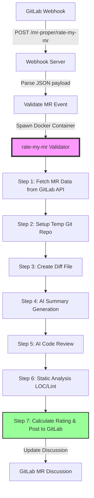
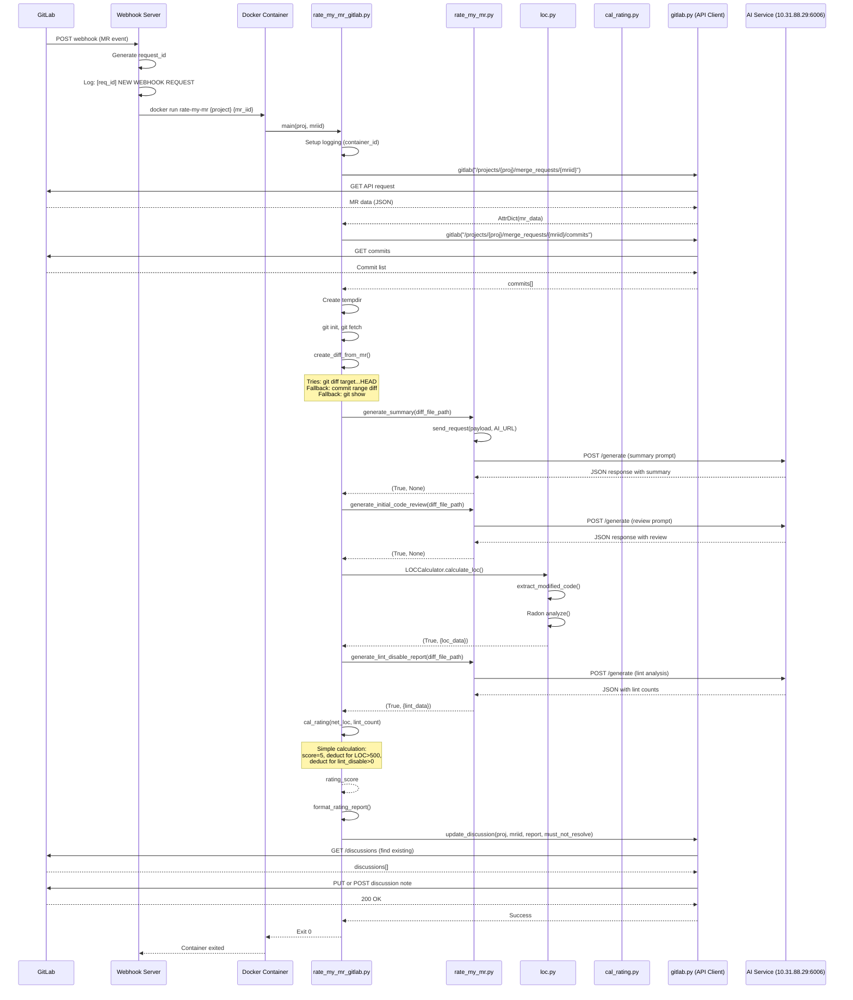
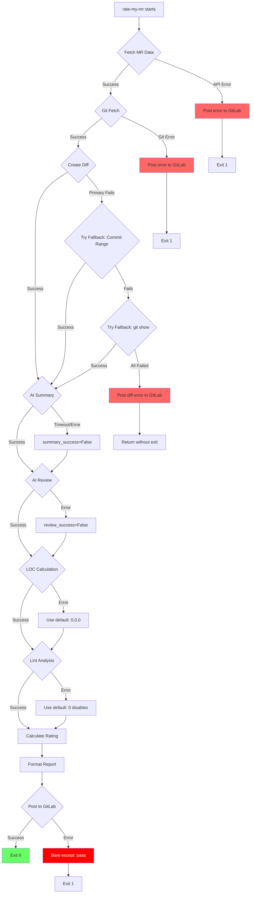

# Rate-My-MR Deep Analysis Report

**Generated**: 2025-11-03
**Analyzed Component**: `rate-my-mr` validator
**Purpose**: Complete workflow analysis, error identification, and logging improvement recommendations

---

## Table of Contents

1. [Executive Summary](#executive-summary)
2. [Complete Workflow Diagrams](#complete-workflow-diagrams)
3. [Function Call Mapping](#function-call-mapping)
4. [Logging Points Analysis](#logging-points-analysis)
5. [Identified Issues & Risks](#identified-issues--risks)
6. [Logging Improvement Design](#logging-improvement-design)
7. [Recommendations](#recommendations)

---

## 1. Executive Summary

### What is `rate-my-mr`?

An AI-powered merge request quality assessment tool that:
- Analyzes MR diffs using AI (Claude API at 10.31.88.29:6006)
- Calculates quality metrics (LOC, lint disables, complexity, security)
- Posts automated quality reports to GitLab discussions
- Blocks low-quality MRs (score < 3/5)

### Key Findings

**✅ What's Working Well:**
- Modular architecture with clear separation of concerns
- Docker-based isolation for concurrent validation
- Comprehensive logging to persistent files
- Fallback mechanisms for diff generation

**⚠️ Critical Issues Found:**
1. **Mixed logging approaches**: `print()` vs `logger.*` inconsistency (73 instances)
2. **No correlation tracking**: Request IDs don't propagate from webhook to validator containers
3. **Dual rating systems**: Simple `cal_rating()` vs complex `CalRating` class (unused in GitLab mode)
4. **Bare exception handling**: Line 451 in rate_my_mr_gitlab.py
5. **No retry logic**: Single AI service timeout = complete failure
6. **Resource leaks**: Temporary files not cleaned up on error paths

---

## 2. Complete Workflow Diagrams

### 2.1 High-Level Flow (7-Step Pipeline)



### 2.2 Detailed Sequence Diagram



### 2.3 Error Handling Flow



### 2.4 Logging Architecture

```mermaid
graph TB
    subgraph "Webhook Server Container"
        WS[server.py] --> WSL[/webhook-server.log/]
    end

    subgraph "rate-my-mr Docker Container 1"
        RM1[rate_my_mr_gitlab.py] --> RML1[/rate-my-mr-{container_id}.log/]
        GL1[gitlab.py] --> GLL1[/gitlab-api-{container_id}.log/]
        RM1 -.print().-> RML1
        RM1 -.logger.info().-> RML1
    end

    subgraph "rate-my-mr Docker Container 2"
        RM2[rate_my_mr_gitlab.py] --> RML2[/rate-my-mr-{container_id2}.log/]
        GL2[gitlab.py] --> GLL2[/gitlab-api-{container_id2}.log/]
    end

    subgraph "Host Filesystem"
        WSL --> LogDir[/home/docker/tmp/mr-validator-logs/]
        RML1 --> LogDir
        GLL1 --> LogDir
        RML2 --> LogDir
        GLL2 --> LogDir
    end

    subgraph "Issues"
        Issue1[❌ No correlation between<br/>webhook request_id and<br/>container logs]
        Issue2[❌ Mixed print() and logger]
        Issue3[❌ No log rotation]
        Issue4[❌ No structured logging]
    end

    style Issue1 fill:#fdd
    style Issue2 fill:#fdd
    style Issue3 fill:#fdd
    style Issue4 fill:#fdd
```

---

## 3. Function Call Mapping

### 3.1 Entry Point Flow

| Step | File | Function | Line | Description | Returns | Logs Generated |
|------|------|----------|------|-------------|---------|----------------|
| 1 | `webhook-server/server.py` | `GitLabWebHookHandler.post()` | 32 | Receives webhook, validates checkers | None | `[req_id] NEW WEBHOOK REQUEST` |
| 2 | `webhook-server/server.py` | `post()` → docker run | 89-98 | Spawns isolated container | subprocess | `[req_id] Docker command: ...` |
| 3 | `mrproper/bin/rate-my-mr` | `#!/usr/bin/env python3` | 1-5 | Entry script | N/A | None |
| 4 | `rate_my_mr_gitlab.py` | `main()` | 414 | CLI argument parsing | Exit code | None (just parsing) |
| 5 | `rate_my_mr_gitlab.py` | `handle_mr(proj, mriid)` | 233 | Main orchestrator | None | `===== STARTING MR ANALYSIS =====` |

### 3.2 MR Data Fetching Phase

| Step | File | Function | Line | API Call | Returns | Error Handling |
|------|------|----------|------|----------|---------|----------------|
| 6 | `rate_my_mr_gitlab.py` | `handle_mr()` | 264 | Fetch MR | `AttrDict` (MR object) | Try/except → raise |
| 7 | `gitlab.py` | `gitlab(url)` | 55 | GET `/projects/{proj}/merge_requests/{mriid}` | `AttrDict` | 401 → exit(1), other → exit(1) |
| 8 | `rate_my_mr_gitlab.py` | `handle_mr()` | 271 | Fetch commits | `list[AttrDict]` | Try/except → raise |
| 9 | `gitlab.py` | `gitlab(url)` | 55 | GET `/projects/{proj}/merge_requests/{mriid}/commits` | `list[AttrDict]` | Same as above |

**Logging**:
- `rate_my_mr_gitlab.py:262`: `print("[DEBUG] Fetching MR data...")`
- `gitlab.py:60`: `logger.info(f"Making GitLab API request: {url}")`
- `gitlab.py:66`: `logger.info(f"GitLab API response: {r.status_code}")`

### 3.3 Git Repository Setup Phase

| Step | File | Function | Line | Git Command | Returns | Error Handling |
|------|------|----------|------|-------------|---------|----------------|
| 10 | `rate_my_mr_gitlab.py` | `handle_mr()` | 284 | Create tempdir | `TemporaryDirectory` context | Auto-cleanup on context exit |
| 11 | `rate_my_mr_gitlab.py` | `handle_mr()` | 288 | `git init -q` | subprocess returncode | `subprocess.call()` - no error check! |
| 12 | `rate_my_mr_gitlab.py` | `handle_mr()` | 290 | Get clone URL | String | None |
| 13 | `gitlab.py` | `get_clone_url(proj)` | 41 | Build OAuth URL | String | None |
| 14 | `rate_my_mr_gitlab.py` | `handle_mr()` | 298 | `git fetch` with depth | subprocess returncode | Try/except → raise |

**Logging**:
- `rate_my_mr_gitlab.py:283`: `print("[DEBUG] Setting up temporary git repository...")`
- `rate_my_mr_gitlab.py:285`: `print(f"[DEBUG] Temporary directory: {tdir}")`
- `rate_my_mr_gitlab.py:304`: `print("[DEBUG] Git fetch completed successfully")`

### 3.4 Diff Creation Phase

| Step | File | Function | Line | Description | Returns | Error Handling |
|------|------|----------|------|-------------|---------|----------------|
| 15 | `rate_my_mr_gitlab.py` | `create_diff_from_mr()` | 44 | Primary: `git diff target...HEAD` | `str` (file path) or `None` | Try/except with fallbacks |
| 16 | `rate_my_mr_gitlab.py` | `create_diff_from_mr()` | 96 | Fallback 1: Commit range diff | `str` (file path) | Try/except |
| 17 | `rate_my_mr_gitlab.py` | `create_diff_from_mr()` | 105 | Fallback 2: `git show` single commit | `str` (file path) | Try/except → return None |

**Logging** (extensive DEBUG prints):
- Line 56: `print(f"[DEBUG] Creating diff for MR {mriid}...")`
- Line 70: `print(f"[DEBUG] Attempting git diff {target_branch}...HEAD")`
- Line 75: `print(f"[DEBUG] Generated diff length: {len(diff_output)}")`
- Line 88: `print(f"[DEBUG] Primary diff method failed: {e}")`
- Line 94: `print(f"[DEBUG] Found {len(mrcommits)} commits")`

**Issues**: All logging uses `print()`, not `logger.*`

### 3.5 AI Analysis Phase

| Step | File | Function | Line | AI Request | Returns | Timeout |
|------|------|----------|------|------------|---------|---------|
| 18 | `rate_my_mr_gitlab.py` | `handle_mr()` | 352 | AI Summary | `(bool, data)` | 120s |
| 19 | `rate_my_mr.py` | `generate_summary(diff_file_path)` | 63 | Summary prompt | `(True, None)` or `(True, None)` | 120s |
| 20 | `rate_my_mr.py` | `send_request(payload, url)` | 19 | POST to AI service | `(status_code, json)` | 120s |
| 21 | `rate_my_mr_gitlab.py` | `handle_mr()` | 357 | AI Code Review | `(bool, data)` | 120s |
| 22 | `rate_my_mr.py` | `generate_initial_code_review(diff_file_path)` | 93 | Review prompt | `(True, None)` or `(True, None)` | 120s |
| 23 | `rate_my_mr.py` | `send_request(payload, url)` | 19 | POST to AI service | `(status_code, json)` | 120s |

**Critical Issue**: Returns are always `(True, None)` regardless of success/failure! (Lines 91, 119 in rate_my_mr.py)

**Logging**:
- `rate_my_mr.py:20`: `print(f"[DEBUG] AI Service Request - URL: {url}")`
- `rate_my_mr.py:27`: `print(f"[DEBUG] AI Service Response - Status Code: {resp.status_code}")`
- `rate_my_mr.py:38-55`: Extensive error logging for all exception types

### 3.6 Static Analysis Phase

| Step | File | Function | Line | Analysis Type | Returns | Error Handling |
|------|------|----------|------|---------------|---------|----------------|
| 24 | `rate_my_mr_gitlab.py` | `handle_mr()` | 363 | LOC calculation | `(bool, dict)` | Try/except in LOC module |
| 25 | `loc.py` | `LOCCalculator.calculate_loc()` | 34 | Radon metrics | `(True, {loc_data})` | Try/except → `(False, str(err))` |
| 26 | `rate_my_mr_gitlab.py` | `handle_mr()` | 375 | Lint disable detection | `(bool, dict)` | Try/except in rate_my_mr.py |
| 27 | `rate_my_mr.py` | `generate_lint_disable_report(diff_file_path)` | 121 | AI lint extraction | `(True, {json})` or `(False, "No data")` | Try/except → `(False, str(err))` |

**Logging**:
- `rate_my_mr_gitlab.py:361`: `print("[DEBUG] Step 3: Calculating LOC metrics...")`
- `rate_my_mr_gitlab.py:365`: `print(f"[DEBUG] LOC analysis result: {'SUCCESS' if loc_success else 'FAILED'}")`
- `rate_my_mr_gitlab.py:368`: `print(f"[DEBUG] LOC analysis failed: {loc_data}")`
- `rate_my_mr_gitlab.py:371`: `print(f"[DEBUG] LOC data: {loc_data}")`

### 3.7 Rating Calculation Phase

| Step | File | Function | Line | Description | Returns | Used in GitLab mode? |
|------|------|----------|------|-------------|---------|---------------------|
| 28 | `rate_my_mr_gitlab.py` | `handle_mr()` | 386 | Calculate rating | `int` (0-5) | ✅ YES |
| 29 | `rate_my_mr_gitlab.py` | `cal_rating(net_loc, lint_count)` | 260 | Simple calculation | `int` | ✅ YES |
| 30 | `cal_rating.py` | `CalRating.cal_rating()` | 95 | Complex calculation | `(bool, err)` | ❌ NO (unused) |

**Critical Finding**: Two rating systems exist!
- **Simple version** (rate_my_mr_gitlab.py:260): Used in production
- **Complex version** (cal_rating.py): Includes cyclomatic complexity & security scan, **NOT used** in GitLab integration

**Logging**:
- `rate_my_mr_gitlab.py:385`: `print("[DEBUG] Step 5: Calculating overall rating...")`
- `rate_my_mr_gitlab.py:390`: `print(f"[DEBUG] Final rating calculated: {rating_score}/5")`

### 3.8 GitLab Posting Phase

| Step | File | Function | Line | API Call | Returns | Error Handling |
|------|------|----------|------|----------|---------|----------------|
| 31 | `rate_my_mr_gitlab.py` | `format_rating_report()` | 126 | Format markdown | `(str, bool)` | None (pure function) |
| 32 | `rate_my_mr_gitlab.py` | `handle_mr()` | 403 | Post to GitLab | None | Try/except → raise |
| 33 | `gitlab.py` | `update_discussion(proj, mriid, header, body, must_not_resolve)` | 156 | GET discussions, PUT/POST note | None | No explicit handling |

**Logging**:
- `rate_my_mr_gitlab.py:401`: `print("[DEBUG] Step 7: Posting results to GitLab...")`
- `rate_my_mr_gitlab.py:404`: `print("[DEBUG] Successfully posted report to GitLab")`
- `gitlab.py:157`: `logger.info(f"Updating discussion for MR {mriid}...")`
- `gitlab.py:164`: `logger.info(f"Found {len(discussions)} existing discussions")`

---

## 4. Logging Points Analysis

### 4.1 Current Logging Distribution

| Module | `print()` Statements | `logger.*` Statements | Total | Consistency Score |
|--------|---------------------|----------------------|-------|-------------------|
| `rate_my_mr_gitlab.py` | 73 | 9 | 82 | **11%** ⚠️ |
| `rate_my_mr.py` | 23 | 0 | 23 | **0%** ❌ |
| `gitlab.py` | 5 | 18 | 23 | **78%** ✅ |
| `loc.py` | 1 | 0 | 1 | **0%** ❌ |
| `webhook-server/server.py` | 2 | 16 | 18 | **89%** ✅ |
| **Total** | **104** | **43** | **147** | **29%** ⚠️ |

**Analysis**: 71% of logging uses `print()`, which goes to both file and console but lacks:
- Log levels (all treated as INFO)
- Structured format
- Easy filtering
- Correlation IDs

### 4.2 Logging Timeline for Single MR Analysis

```
[Webhook Server Log]
  T+0.000s   [a1b2c3d4] === NEW WEBHOOK REQUEST ===
  T+0.001s   [a1b2c3d4] Requested checkers: rate-my-mr
  T+0.002s   [a1b2c3d4] Processing MR event
  T+0.003s   [a1b2c3d4] Project: my-org/my-project, MR IID: 123
  T+0.050s   [a1b2c3d4] Docker command: docker run -d ...
  T+0.100s   [a1b2c3d4] Checker rate-my-mr container started successfully
  T+0.101s   [a1b2c3d4] === WEBHOOK REQUEST COMPLETED ===

[rate-my-mr-abc123def456.log] ❌ NO CORRELATION ID
  T+0.200s   ===== STARTING MR ANALYSIS =====
  T+0.201s   [DEBUG] Project: my-org%2Fmy-project
  T+0.202s   [DEBUG] MR IID: 123
  T+0.203s   [DEBUG] Fetching MR data from GitLab API...
  ... (73 more [DEBUG] print statements)

[gitlab-api-abc123def456.log] ❌ NO CORRELATION ID
  T+0.205s   Making GitLab API request: https://git.internal.com/api/v4/projects/...
  T+0.350s   GitLab API response: 200 for https://git.internal.com/...
  ... (18 more structured logs)
```

**Problem**: Cannot correlate webhook request `[a1b2c3d4]` with container logs!

### 4.3 Missing Logging Points

| Location | Missing Information | Impact |
|----------|---------------------|--------|
| **rate_my_mr_gitlab.py:288** | `git init` return code | Silent git failures |
| **rate_my_mr.py:91, 119** | Actual success/failure status | Returns `(True, None)` even on failure |
| **rate_my_mr_gitlab.py:367-369** | LOC calculation errors | No stack trace logged |
| **rate_my_mr_gitlab.py:378-382** | Lint analysis errors | No stack trace logged |
| **rate_my_mr_gitlab.py:451** | Bare `except: pass` | Silences all posting errors |
| **All modules** | Execution duration per step | No performance monitoring |
| **All modules** | Request correlation ID | Cannot trace end-to-end |

---

## 5. Identified Issues & Risks

### 5.1 Critical Issues (Severity: HIGH)

#### Issue #1: Bare Exception Handling Silences Errors
**Location**: `rate_my_mr_gitlab.py:451-452`

```python
except:  # noqa: E722
    pass  # Don't fail on error reporting failure
```

**Problem**: If posting to GitLab fails, the error is completely silenced. User receives no feedback.

**Impact**:
- Failed validations appear successful
- Debugging becomes impossible
- No visibility into GitLab API issues

**Risk**: HIGH - Silent failures

---

#### Issue #2: AI Functions Always Return Success
**Location**: `rate_my_mr.py:91, 119`

```python
def generate_summary(file_path):
    # ... AI request logic ...
    if status_code != 200:
        print(f"Failed to generate summary: {code_summary}")
    else:
        # ... print content ...
    return True, None  # ❌ ALWAYS returns True!

def generate_initial_code_review(file_path):
    # ... AI request logic ...
    if status_code != 200:
        print(f"Failed to generate summary: {initial_review}")
    else:
        # ... print content ...
    return True, None  # ❌ ALWAYS returns True!
```

**Problem**: Even on HTTP 500 errors or timeouts, returns `(True, None)`.

**Impact**:
- `rate_my_mr_gitlab.py:353, 358` always sees success
- Rating report shows "✅ Success" even when AI failed
- Users trust invalid assessments

**Risk**: HIGH - Incorrect validation results

---

#### Issue #3: No Request Correlation Between Webhook and Containers
**Location**: `webhook-server/server.py:34` vs `rate_my_mr_gitlab.py:15`

```python
# Webhook generates:
request_id_short = request_id.split('_')[-1][:8]  # e.g., "a1b2c3d4"

# Container uses different ID:
container_id = os.environ.get('HOSTNAME', 'unknown')  # e.g., "abc123def456"
```

**Problem**: No way to link webhook request to validator logs.

**Impact**:
- Cannot trace issues end-to-end
- Debugging requires matching timestamps (unreliable)
- No visibility into which webhook triggered which validation

**Risk**: HIGH - Operational visibility

---

#### Issue #4: Dual Rating Systems (One Unused)
**Location**:
- Production: `rate_my_mr_gitlab.py:260-272` (simple version)
- Unused: `cal_rating.py:5-117` (complex version with CC & security)

**Simple Version (USED)**:
```python
def cal_rating(net_loc, lint_disable_count):
    score = 5
    if net_loc > 500: score -= 1
    if lint_disable_count > 0: score -= 1
    return max(score, 0)
```

**Complex Version (UNUSED)**:
```python
class CalRating:
    def cal_rating(self):
        # Considers: LOC, lint disables, cyclomatic complexity, security scan
        # Uses configurable weights from params.py
        # Returns detailed table
```

**Problem**:
- Code confusion - which is the "real" rating?
- Complex version has more comprehensive analysis but isn't used
- Maintenance burden for unused code

**Risk**: MEDIUM - Code maintainability

---

### 5.2 High-Priority Issues (Severity: MEDIUM)

#### Issue #5: No Retry Logic for AI Service
**Location**: `rate_my_mr.py:26`

```python
resp = requests.post(url, json=payload, timeout=120)
```

**Problem**: Single timeout = complete failure. No retries for transient errors.

**Impact**:
- Network blips cause validation failure
- AI service restarts block all MRs
- No exponential backoff

**Risk**: MEDIUM - Availability

---

#### Issue #6: Git Commands Without Error Checking
**Location**: `rate_my_mr_gitlab.py:288`

```python
subprocess.call(["git", "init", "-q"], cwd=tdir)  # ❌ No error check!
```

**Problem**: `subprocess.call()` returns exit code but it's ignored.

**Impact**:
- If `git init` fails, subsequent git commands fail cryptically
- No visibility into git errors

**Risk**: MEDIUM - Robustness

---

#### Issue #7: Temporary File Leaks
**Location**: `loc.py:40-44`

```python
with open('modified_code.py', 'w') as temp_file:
    temp_file.write(modified_code)
with open('removed_code.py', 'w') as temp_file:
    temp_file.write(removed_code)
```

**Problem**:
- Files created in current directory (not tempfile)
- No cleanup on error
- Not thread-safe (concurrent MRs overwrite each other!)

**Risk**: MEDIUM - Resource leaks & race conditions

---

#### Issue #8: Mixed Logging Approaches (71% print, 29% logger)
**Location**: All modules

**Problem**:
- `print()` statements can't be filtered by level
- No way to suppress DEBUG output in production
- Inconsistent log format

**Risk**: MEDIUM - Operational maintainability

---

### 5.3 Low-Priority Issues (Severity: LOW)

#### Issue #9: No Log Rotation
**Location**: All log files in `/home/docker/tmp/mr-validator-logs/`

**Problem**: Logs grow indefinitely, no rotation policy.

**Impact**: Disk space exhaustion over time.

**Risk**: LOW - Long-term operational issue

---

#### Issue #10: Hardcoded AI Service URL
**Location**: `params.py:4`

```python
class RMMConstants(Enum):
    agent_url = "http://10.31.88.29:6006/generate"
```

**Problem**: IP address hardcoded, not configurable via environment.

**Risk**: LOW - Deployment flexibility

---

### 5.4 Risk Summary Table

| Issue # | Description | Severity | Impact | Likelihood | Priority |
|---------|-------------|----------|--------|------------|----------|
| #1 | Bare exception silences errors | HIGH | Complete failure invisibility | Medium | **P0** |
| #2 | AI functions always return True | HIGH | Invalid validation results | High | **P0** |
| #3 | No request correlation IDs | HIGH | Cannot debug issues | High | **P0** |
| #4 | Dual rating systems | MEDIUM | Code confusion | Low | **P1** |
| #5 | No AI retry logic | MEDIUM | Transient failures = total failure | Medium | **P1** |
| #6 | Git command errors unchecked | MEDIUM | Cryptic failures | Low | **P1** |
| #7 | Temporary file leaks/races | MEDIUM | Resource exhaustion, data corruption | Medium | **P1** |
| #8 | Mixed logging approaches | MEDIUM | Hard to filter/analyze | High | **P1** |
| #9 | No log rotation | LOW | Disk exhaustion | Low | **P2** |
| #10 | Hardcoded AI URL | LOW | Inflexible deployment | Low | **P2** |

---

## 6. Logging Improvement Design

### 6.1 Design Principles

1. **Structured Logging**: JSON format for machine parsing
2. **Correlation Tracking**: End-to-end request ID propagation
3. **Consistent Interface**: Single logging module for all validators
4. **Performance Monitoring**: Automatic duration tracking
5. **Backward Compatible**: Can deploy incrementally
6. **Persistent & Rotated**: File-based with automatic rotation

### 6.2 Proposed Architecture

```
mrproper/
  mrproper/
    logging_config.py          # NEW: Centralized logging setup
    structured_logger.py       # NEW: JSON logger wrapper
    context.py                 # NEW: Request context manager

webhook-server/
  server.py                    # MODIFIED: Pass request_id to containers

Log Structure:
  /home/docker/tmp/mr-validator-logs/
    webhook-server.log         # Structured JSON
    webhook-server.log.1.gz    # Rotated
    rate-my-mr/                # NEW: Per-validator subdirectory
      20251103_103045_a1b2c3d4.log  # Request-specific log
      20251103_104032_b2c3d4e5.log
    gitlab-api/                # NEW: Centralized API logs
      20251103.log             # Daily rotation
      20251103.log.1.gz
```

### 6.3 Structured Log Format

```json
{
  "timestamp": "2025-11-03T10:30:45.123456Z",
  "level": "INFO",
  "request_id": "20251103_103045_a1b2c3d4",
  "container_id": "abc123def456",
  "module": "rate_my_mr_gitlab",
  "function": "handle_mr",
  "line": 264,
  "project": "my-org/my-project",
  "mr_iid": 123,
  "message": "Fetching MR data from GitLab API",
  "duration_ms": null,
  "error": null,
  "extra": {}
}
```

### 6.4 New Logging Module Design

#### File: `mrproper/mrproper/logging_config.py`

```python
"""
Centralized logging configuration for MR validators.
Provides structured JSON logging with request correlation.
"""

import logging
import logging.handlers
import json
import os
import time
from datetime import datetime
from typing import Optional, Dict, Any
from contextlib import contextmanager


class StructuredFormatter(logging.Formatter):
    """JSON formatter for structured logging"""

    def format(self, record: logging.LogRecord) -> str:
        log_data = {
            "timestamp": datetime.utcfromtimestamp(record.created).isoformat() + "Z",
            "level": record.levelname,
            "module": record.module,
            "function": record.funcName,
            "line": record.lineno,
            "message": record.getMessage(),
        }

        # Add context from record (set by RequestContext)
        if hasattr(record, 'request_id'):
            log_data['request_id'] = record.request_id
        if hasattr(record, 'container_id'):
            log_data['container_id'] = record.container_id
        if hasattr(record, 'project'):
            log_data['project'] = record.project
        if hasattr(record, 'mr_iid'):
            log_data['mr_iid'] = record.mr_iid
        if hasattr(record, 'duration_ms'):
            log_data['duration_ms'] = record.duration_ms

        # Add exception info if present
        if record.exc_info:
            log_data['error'] = self.formatException(record.exc_info)

        # Add any extra fields
        if hasattr(record, 'extra'):
            log_data['extra'] = record.extra

        return json.dumps(log_data)


class RequestContextFilter(logging.Filter):
    """Injects request context into log records"""

    def __init__(self):
        super().__init__()
        self.context = {}

    def filter(self, record: logging.LogRecord) -> bool:
        # Inject context into record
        for key, value in self.context.items():
            setattr(record, key, value)
        return True


class ValidatorLogger:
    """
    Main logger class for validators with request context support.

    Usage:
        logger = ValidatorLogger.get_logger(
            validator_name='rate-my-mr',
            request_id='20251103_103045_a1b2c3d4'
        )

        with logger.context(project='my-org/my-project', mr_iid=123):
            logger.info("Fetching MR data")

        with logger.timed("AI summary generation"):
            # ... long operation ...
            pass  # Automatically logs duration
    """

    _loggers: Dict[str, 'ValidatorLogger'] = {}

    def __init__(self, validator_name: str, request_id: Optional[str] = None):
        self.validator_name = validator_name
        self.request_id = request_id or os.environ.get('REQUEST_ID', 'unknown')
        self.container_id = os.environ.get('HOSTNAME', 'unknown')

        # Create logger
        self.logger = logging.getLogger(f"mrproper.{validator_name}")
        self.logger.setLevel(logging.DEBUG)
        self.logger.propagate = False

        # Add context filter
        self.context_filter = RequestContextFilter()
        self.context_filter.context = {
            'request_id': self.request_id,
            'container_id': self.container_id
        }
        self.logger.addFilter(self.context_filter)

        # Setup handlers (file + console)
        self._setup_handlers()

    def _setup_handlers(self):
        """Setup rotating file handler and console handler"""

        # Ensure log directory exists
        log_dir = '/home/docker/tmp/mr-validator-logs'
        validator_log_dir = os.path.join(log_dir, self.validator_name)
        os.makedirs(validator_log_dir, exist_ok=True)

        # File handler - per-request log file
        log_file = os.path.join(validator_log_dir, f"{self.request_id}.log")
        file_handler = logging.FileHandler(log_file)
        file_handler.setLevel(logging.DEBUG)
        file_handler.setFormatter(StructuredFormatter())

        # Console handler - human-readable for debugging
        console_handler = logging.StreamHandler()
        console_handler.setLevel(logging.INFO)
        console_handler.setFormatter(logging.Formatter(
            '%(asctime)s - [%(request_id)s] - %(levelname)s - %(message)s',
            datefmt='%Y-%m-%d %H:%M:%S'
        ))

        self.logger.addHandler(file_handler)
        self.logger.addHandler(console_handler)

    @classmethod
    def get_logger(cls, validator_name: str, request_id: Optional[str] = None) -> 'ValidatorLogger':
        """Get or create logger for validator"""
        key = f"{validator_name}:{request_id}"
        if key not in cls._loggers:
            cls._loggers[key] = cls(validator_name, request_id)
        return cls._loggers[key]

    @contextmanager
    def context(self, **kwargs):
        """Temporarily add context to all log messages"""
        old_context = self.context_filter.context.copy()
        self.context_filter.context.update(kwargs)
        try:
            yield
        finally:
            self.context_filter.context = old_context

    @contextmanager
    def timed(self, operation: str):
        """
        Context manager that logs operation duration.

        Usage:
            with logger.timed("Fetching MR data"):
                # ... operation ...
                pass
        """
        start_time = time.time()
        self.info(f"Starting: {operation}")
        try:
            yield
        except Exception as e:
            duration_ms = (time.time() - start_time) * 1000
            self.error(f"Failed: {operation}", extra={'duration_ms': duration_ms}, exc_info=True)
            raise
        else:
            duration_ms = (time.time() - start_time) * 1000
            self.info(f"Completed: {operation}", extra={'duration_ms': duration_ms})

    # Standard logging methods
    def debug(self, msg: str, **kwargs):
        self.logger.debug(msg, **kwargs)

    def info(self, msg: str, **kwargs):
        self.logger.info(msg, **kwargs)

    def warning(self, msg: str, **kwargs):
        self.logger.warning(msg, **kwargs)

    def error(self, msg: str, **kwargs):
        self.logger.error(msg, **kwargs)

    def critical(self, msg: str, **kwargs):
        self.logger.critical(msg, **kwargs)


def migrate_from_print(logger: ValidatorLogger):
    """
    Decorator to migrate existing print() statements to logger.

    Usage:
        @migrate_from_print(logger)
        def my_function():
            print("[DEBUG] This will be logged")  # Converted to logger.debug()
    """
    import sys
    from io import StringIO

    class LoggerWriter:
        def __init__(self, logger, level):
            self.logger = logger
            self.level = level
            self.buffer = StringIO()

        def write(self, message):
            if message.strip():
                # Detect debug messages
                if message.startswith("[DEBUG]"):
                    self.logger.debug(message.replace("[DEBUG]", "").strip())
                else:
                    getattr(self.logger, self.level)(message.strip())

        def flush(self):
            pass

    def decorator(func):
        def wrapper(*args, **kwargs):
            old_stdout = sys.stdout
            sys.stdout = LoggerWriter(logger, 'info')
            try:
                return func(*args, **kwargs)
            finally:
                sys.stdout = old_stdout
        return wrapper
    return decorator
```

### 6.5 Updated Webhook Server (Pass Request ID)

```python
# webhook-server/server.py (modified section)

docker_cmd = [
    "docker", "run", "-d", "--rm",
    "--env-file", "mrproper.env",
    "--env", f"REQUEST_ID={request_id}",  # NEW: Pass request ID
    "--log-driver=syslog",
    "--volume", "/home/docker/tmp/mr-validator-logs:/home/docker/tmp/mr-validator-logs",
    "--name", f"mr-{c}-{data.object_attributes.iid}-{request_id_short}",
    "mr-checker-vp-test", c,
    data.project.path_with_namespace,
    str(data.object_attributes.iid)
]
```

### 6.6 Updated rate_my_mr_gitlab.py (Example Usage)

```python
# rate_my_mr_gitlab.py (modified sections)

from mrproper.logging_config import ValidatorLogger

def handle_mr(proj, mriid):
    """Main MR analysis function with GitLab integration"""

    # Initialize structured logger
    logger = ValidatorLogger.get_logger(
        validator_name='rate-my-mr',
        request_id=os.environ.get('REQUEST_ID')
    )

    with logger.context(project=proj, mr_iid=mriid):
        logger.info("===== STARTING MR ANALYSIS =====")

        try:
            # Fetch MR data
            with logger.timed("Fetch MR data from GitLab"):
                mr = gitlab.gitlab(f"/projects/{proj}/merge_requests/{mriid}")

            with logger.timed("Fetch MR commits"):
                mrcommits = gitlab.gitlab(f"/projects/{proj}/merge_requests/{mriid}/commits")

            # Setup git repo
            with tempfile.TemporaryDirectory() as tdir:
                with logger.timed("Setup temporary git repository"):
                    subprocess.check_call(["git", "init", "-q"], cwd=tdir)  # Now with error checking!
                    # ... rest of git setup ...

                # Create diff
                with logger.timed("Create diff file"):
                    diff_file_path = create_diff_from_mr(proj, mriid, tdir, mr, mrcommits)

                if not diff_file_path:
                    logger.error("Failed to create diff file")
                    # Post error to GitLab
                    return

                # AI analysis
                with logger.timed("AI summary generation"):
                    summary_success, _ = generate_summary(diff_file_path, logger)

                with logger.timed("AI code review"):
                    review_success, _ = generate_initial_code_review(diff_file_path, logger)

                # Static analysis
                with logger.timed("LOC calculation"):
                    loc_success, loc_data = LOCCalculator(diff_file_path).calculate_loc()

                with logger.timed("Lint disable analysis"):
                    lint_success, lint_data = generate_lint_disable_report(diff_file_path, logger)

                # Calculate rating
                rating_score = cal_rating(
                    loc_data.get('net_lines_of_code_change', 0),
                    lint_data.get('num_lint_disable', 0)
                )
                logger.info(f"Final rating: {rating_score}/5")

            # Post to GitLab
            with logger.timed("Post results to GitLab"):
                report_body, must_not_be_resolved = format_rating_report(
                    summary_success, review_success, loc_data, lint_data, rating_score
                )
                gitlab.update_discussion(proj, mriid, HEADER, report_body, must_not_be_resolved)

            logger.info("===== MR ANALYSIS COMPLETED =====")

        except Exception as e:
            logger.error("MR analysis failed", exc_info=True)
            # Post error to GitLab (with proper error logging, not bare except!)
            try:
                error_report = f"## :x: MR Quality Assessment Error\n\n```\n{str(e)}\n```"
                gitlab.update_discussion(proj, mriid, HEADER, error_report, False)
            except Exception as posting_error:
                logger.error("Failed to post error report to GitLab", exc_info=True)
            raise
```

### 6.7 Example Log Output (Structured)

**File**: `/home/docker/tmp/mr-validator-logs/rate-my-mr/20251103_103045_a1b2c3d4.log`

```json
{"timestamp": "2025-11-03T10:30:45.123456Z", "level": "INFO", "request_id": "20251103_103045_a1b2c3d4", "container_id": "abc123def456", "module": "rate_my_mr_gitlab", "function": "handle_mr", "line": 240, "project": "my-org%2Fmy-project", "mr_iid": 123, "message": "===== STARTING MR ANALYSIS ====="}
{"timestamp": "2025-11-03T10:30:45.234567Z", "level": "INFO", "request_id": "20251103_103045_a1b2c3d4", "container_id": "abc123def456", "module": "rate_my_mr_gitlab", "function": "handle_mr", "line": 248, "project": "my-org%2Fmy-project", "mr_iid": 123, "message": "Starting: Fetch MR data from GitLab"}
{"timestamp": "2025-11-03T10:30:45.567890Z", "level": "INFO", "request_id": "20251103_103045_a1b2c3d4", "container_id": "abc123def456", "module": "rate_my_mr_gitlab", "function": "handle_mr", "line": 248, "project": "my-org%2Fmy-project", "mr_iid": 123, "message": "Completed: Fetch MR data from GitLab", "extra": {"duration_ms": 333.333}}
{"timestamp": "2025-11-03T10:30:47.123456Z", "level": "INFO", "request_id": "20251103_103045_a1b2c3d4", "container_id": "abc123def456", "module": "rate_my_mr_gitlab", "function": "handle_mr", "line": 265, "project": "my-org%2Fmy-project", "mr_iid": 123, "message": "Starting: AI summary generation"}
{"timestamp": "2025-11-03T10:30:52.234567Z", "level": "INFO", "request_id": "20251103_103045_a1b2c3d4", "container_id": "abc123def456", "module": "rate_my_mr_gitlab", "function": "handle_mr", "line": 265, "project": "my-org%2Fmy-project", "mr_iid": 123, "message": "Completed: AI summary generation", "extra": {"duration_ms": 5111.111}}
{"timestamp": "2025-11-03T10:30:58.345678Z", "level": "INFO", "request_id": "20251103_103045_a1b2c3d4", "container_id": "abc123def456", "module": "rate_my_mr_gitlab", "function": "handle_mr", "line": 295, "project": "my-org%2Fmy-project", "mr_iid": 123, "message": "Final rating: 4/5"}
{"timestamp": "2025-11-03T10:30:59.456789Z", "level": "INFO", "request_id": "20251103_103045_a1b2c3d4", "container_id": "abc123def456", "module": "rate_my_mr_gitlab", "function": "handle_mr", "line": 310, "project": "my-org%2Fmy-project", "mr_iid": 123, "message": "===== MR ANALYSIS COMPLETED ====="}
```

**Benefits**:
- Easy to parse with `jq`, Python, or log aggregators
- Request ID correlates back to webhook
- Duration metrics for every step
- Can filter by project, MR, level, etc.

### 6.8 Log Rotation Strategy

```python
# In logging_config.py, replace FileHandler with RotatingFileHandler

from logging.handlers import RotatingFileHandler

# File handler - with rotation
log_file = os.path.join(validator_log_dir, f"{self.request_id}.log")
file_handler = RotatingFileHandler(
    log_file,
    maxBytes=100 * 1024 * 1024,  # 100 MB per file
    backupCount=5,                 # Keep 5 rotated files
    encoding='utf-8'
)
```

**Retention Policy**:
- Max file size: 100 MB
- Keep 5 rotated files per request ID
- Total max: 600 MB per request
- Automatic compression recommended (external tool)

### 6.9 Migration Strategy

**Phase 1: Add New Logging (No Breaking Changes)**
1. Add `logging_config.py` to `mrproper/mrproper/`
2. Deploy to staging, verify log output
3. No changes to existing code yet

**Phase 2: Migrate rate-my-mr**
1. Update `rate_my_mr_gitlab.py` to use `ValidatorLogger`
2. Replace all `print("[DEBUG] ...")` with `logger.debug(...)`
3. Add `with logger.timed()` context managers
4. Deploy, compare logs side-by-side

**Phase 3: Migrate Other Validators**
1. Update `mrproper-message` to use structured logging
2. Update `mrproper-clang-format`
3. Standardize across all validators

**Phase 4: Deprecate print()**
1. Add linter rule to block `print()` in validator code
2. Remove old logging code

**Timeline**: ~2-3 sprints (incremental, low risk)

---

## 7. Recommendations

### 7.1 Immediate Actions (Week 1)

1. **Fix Critical Bugs**:
   - ❌ Remove bare `except: pass` at line 451 → log and re-raise
   - ❌ Fix `generate_summary()` and `generate_initial_code_review()` to return actual status
   - ❌ Add error checking for `git init` command

2. **Add Request Correlation**:
   - ✅ Pass `REQUEST_ID` env var from webhook to containers
   - ✅ Include in all log messages (even print statements)

3. **Document Dual Rating System**:
   - 📝 Add comment explaining why `CalRating` class exists but isn't used
   - 📝 Decide: deprecate or integrate into GitLab mode

### 7.2 Short-Term Improvements (Month 1)

4. **Implement Structured Logging**:
   - ✅ Create `logging_config.py` module
   - ✅ Migrate `rate-my-mr` to use `ValidatorLogger`
   - ✅ Deploy to staging, validate

5. **Add Retry Logic for AI Service**:
   - ✅ Implement exponential backoff (3 retries: 2s, 4s, 8s)
   - ✅ Log retry attempts
   - ✅ Only fail after all retries exhausted

6. **Fix Temporary File Handling**:
   - ✅ Use `tempfile.NamedTemporaryFile()` in `loc.py`
   - ✅ Ensure cleanup with context managers

### 7.3 Long-Term Enhancements (Quarter 1)

7. **Integrate Complex Rating System**:
   - Consider using `CalRating` class with CC & security scan
   - Requires longer execution time (acceptable?)
   - More comprehensive quality metrics

8. **Add Performance Monitoring**:
   - Log duration for every major step
   - Track AI service latency over time
   - Alert on slow validations

9. **Centralized Log Aggregation** (Optional):
   - Consider ELK stack or cloud logging
   - Real-time monitoring dashboard
   - Alerting on error rates

10. **Add Unit Tests**:
    - Test rating calculation logic
    - Mock AI service responses
    - Test error handling paths

### 7.4 Priority Matrix

```
High Impact, Low Effort (DO FIRST):
  - Fix bare exception handling (#1)
  - Fix AI function return values (#2)
  - Add request correlation (#3)

High Impact, High Effort (SCHEDULE):
  - Implement structured logging (#8)
  - Add AI retry logic (#5)

Low Impact, Low Effort (NICE TO HAVE):
  - Document dual rating systems (#4)
  - Fix git error checking (#6)

Low Impact, High Effort (DEFER):
  - Centralized log aggregation
  - Full test coverage
```

---

## Appendix A: File Reference

| File | Lines | Purpose | Issues Found |
|------|-------|---------|--------------|
| `webhook-server/server.py` | 174 | Webhook receiver, container spawner | No correlation ID passing |
| `rate_my_mr_gitlab.py` | 459 | Main GitLab integration | 73 print statements, bare except |
| `rate_my_mr.py` | 310 | AI analysis functions | Always returns True |
| `gitlab.py` | 212 | GitLab API client | Good logging |
| `loc.py` | 81 | LOC calculator | Temp file races |
| `cal_rating.py` | 118 | Complex rating (unused) | Dead code? |
| `params.py` | 33 | Configuration constants | Hardcoded AI URL |

---

## Appendix B: Glossary

- **MR**: Merge Request (GitLab terminology)
- **IID**: Internal ID (GitLab's per-project MR number)
- **LOC**: Lines of Code
- **CC**: Cyclomatic Complexity
- **AI Service**: Claude API running on 10.31.88.29:6006
- **Radon**: Python code metrics library
- **Bandit**: Python security scanner
- **Tornado**: Python async web framework

---

**End of Analysis Report**
